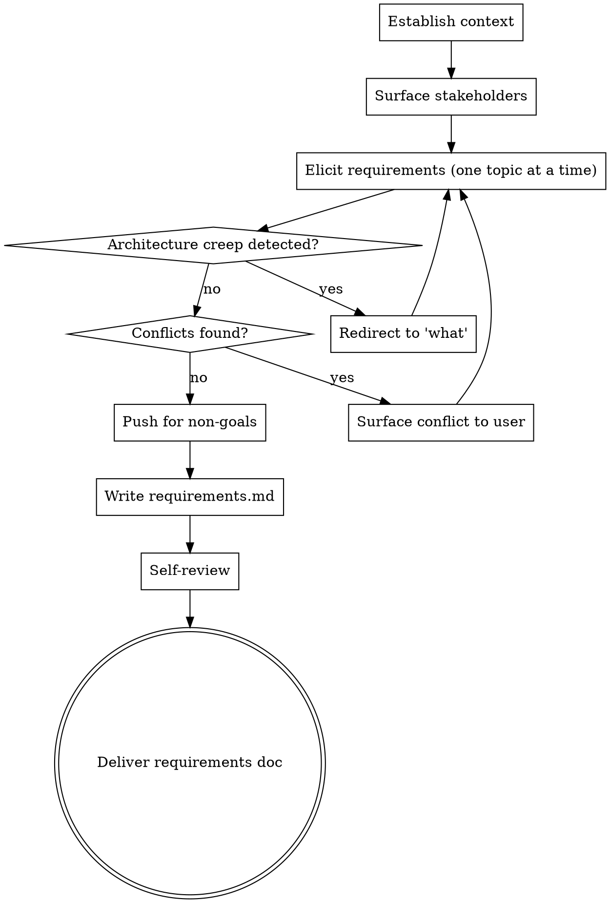

# Drafting Requirements

Take a problem, feature, or system idea and produce a requirements document that defines **what** it must do — without slipping into **how** it does it.

The hardest job of this skill is **resisting architecture creep**. Discussions of requirements naturally drift toward implementation: "we'll need a queue", "this should be a REST API", "use Postgres for that". Every time that happens, this skill must catch it and redirect.

<HARD-GATE>
Do NOT propose architecture, components, data models, technology choices, file layouts, APIs, or implementation patterns. If the user steers toward implementation, name the drift and redirect to the underlying need. Architecture happens elsewhere — this skill defines the target it has to hit.
</HARD-GATE>

## Anti-Pattern: "How" Disguised As "What"

These statements look like requirements but are architecture in disguise. Catch and rewrite them:

| Implementation creep | Requirement form |
|---|---|
| "The system uses a queue to process events" | "The system must accept events faster than it processes them, without losing any" |
| "Store user data in Postgres" | "User data must persist across restarts and be queryable by ID and email" |
| "Expose a REST API" | "External systems must be able to read and modify <X> programmatically" |
| "Use OAuth" | "Users must authenticate using their existing organisation accounts" |
| "Dockerised microservices" | (delete entirely — this is purely architecture) |

Rule of thumb: if the requirement could be satisfied by two genuinely different architectures, it's a requirement. If it can only be satisfied one way, it's architecture — rewrite it as the underlying need.

## Anti-Pattern: Vague Verbs

"Fast", "simple", "scalable", "robust", "user-friendly" are not requirements. Every adjective must come with a measurable threshold or it gets cut. "Responds within 200ms at p95" is a requirement; "fast" is wishful thinking.

## Checklist

You MUST create a task for each of these items and complete them in order:

1. **Establish context** — read any existing problem statement, brief, or research the user points to; otherwise ask for a one-sentence problem statement
2. **Surface stakeholders and users** — who uses this, who is affected, who decides if it's done
3. **Elicit requirements one topic at a time** — functional, non-functional, non-goals
4. **Push for non-goals explicitly** — what this will NOT do, equally important as goals
5. **Surface conflicts** — when requirements collide, name it; do not silently resolve
6. **Write `requirements.md`** — to `docs/requirements/YYYY-MM-DD-<topic>-requirements.md`
7. **Self-review** — measurability, no architecture creep, no contradictions, no vague verbs
8. **Deliver** — present the doc; the user decides what to do next

## Process Flow



## The Process

### 1. Establish context

Ask the user for a one-sentence problem statement and any background material they want you to read (briefs, research, tickets, prior docs). If they gesture at a doc, read it before asking further questions. Do not assume any specific predecessor exists — this skill works equally well as the entry point or as a follow-up to other research.

### 2. Surface stakeholders and users

Ask one at a time:

- "Who uses this directly?"
- "Who is affected by it but doesn't use it?"
- "Who decides whether it's done?"

A requirement only matters if it traces back to a real stakeholder need. Name the stakeholder for each requirement when possible.

### 3. Elicit requirements one topic at a time

Move through three categories. **One question per message.** Prefer multiple-choice or short-answer questions when possible.

**Functional requirements** — what the system does:
- Inputs it accepts, outputs it produces, behaviours it must exhibit
- For each: who triggers it, what's the expected outcome, what are edge cases

**Non-functional requirements** — qualities the system must have:
- Performance (with thresholds — "fast" is not a requirement)
- Availability / reliability (with targets)
- Security and privacy constraints
- Compliance / regulatory constraints
- Operational constraints (deployment, observability, cost)

**Non-goals** — what the system will deliberately NOT do:
- Out-of-scope features users might expect
- Use cases explicitly not supported
- Future ambitions explicitly deferred

### 4. Push for non-goals explicitly

Most users underspecify non-goals. Push:

- "What might a user reasonably expect this to do that we're not going to support?"
- "What's the closest adjacent problem this does NOT solve?"
- "What would scope creep look like, in concrete terms?"

A requirements doc with no non-goals is almost always incomplete.

### 5. Surface conflicts

When two requirements pull in different directions — high availability vs. strong consistency, low latency vs. rich audit logging, broad compatibility vs. small surface area — name the conflict explicitly:

> "Requirement A says <X> and requirement B says <Y>. These are in tension because <Z>. How would you like to resolve this — prioritise one, accept a compromise threshold, or treat one as a non-goal?"

Do not silently pick a resolution. Conflicts that hide here become bugs later.

### 6. Write `requirements.md`

Save to `docs/requirements/YYYY-MM-DD-<topic>-requirements.md`. Structure:

```markdown
# Requirements: <topic>

**Date:** YYYY-MM-DD
**Status:** draft | approved
**Source:** <link to brief / research / ticket, if any>

## Problem statement
<one paragraph>

## Stakeholders
- **<Role>:** <what they need from this system>

## Functional requirements

### FR1: <short name>
**Stakeholder:** <role>
**Description:** <what the system must do>
**Acceptance:** <how we know it's done — observable behaviour, not implementation>

<repeat>

## Non-functional requirements

### NFR1: <short name>
**Category:** performance | reliability | security | compliance | operations
**Threshold:** <measurable target>
**Rationale:** <why this threshold>

<repeat>

## Non-goals
- **NG1:** <thing this will NOT do>, because <reason>

## Known conflicts and resolutions
- **<Requirement A> vs. <Requirement B>:** <how the user resolved it>

## Open questions
- <anything still unresolved>
```

### 7. Self-review

Read the doc with fresh eyes:

1. **Architecture creep scan** — for every requirement, ask: could this be satisfied by two genuinely different implementations? If no, it's architecture in disguise — rewrite it.
2. **Vague-verb scan** — search for "fast", "simple", "scalable", "robust", "user-friendly", "easy", "intuitive". Each must have a measurable threshold or be cut.
3. **Acceptance criteria** — every functional requirement has an observable acceptance condition.
4. **Stakeholder traceability** — every requirement names a stakeholder or is rewritten.
5. **Non-goal coverage** — at least one non-goal per major functional area.
6. **Internal consistency** — no requirement contradicts another silently. Open conflicts go in "Known conflicts" or "Open questions".

Fix issues inline.

### 8. Deliver

Present:

> "Requirements written to `<path>`. Particularly worth your eyes: the non-goals, and any open questions."

The user takes it from there. Do not assume what they want to do next — they may take it to architecture, share it with stakeholders, refine it further, or use it as input to something else entirely.

## Key Principles

- **What, not how.** Architecture happens elsewhere. Defend this boundary.
- **One question at a time.**
- **Measurable or cut.** Every quality attribute needs a threshold.
- **Non-goals are first-class.** Push for them; an empty non-goals section is a red flag.
- **Surface conflicts; don't resolve them silently.**
- **Stakeholder traceability.** A requirement with no stakeholder is usually invented.
