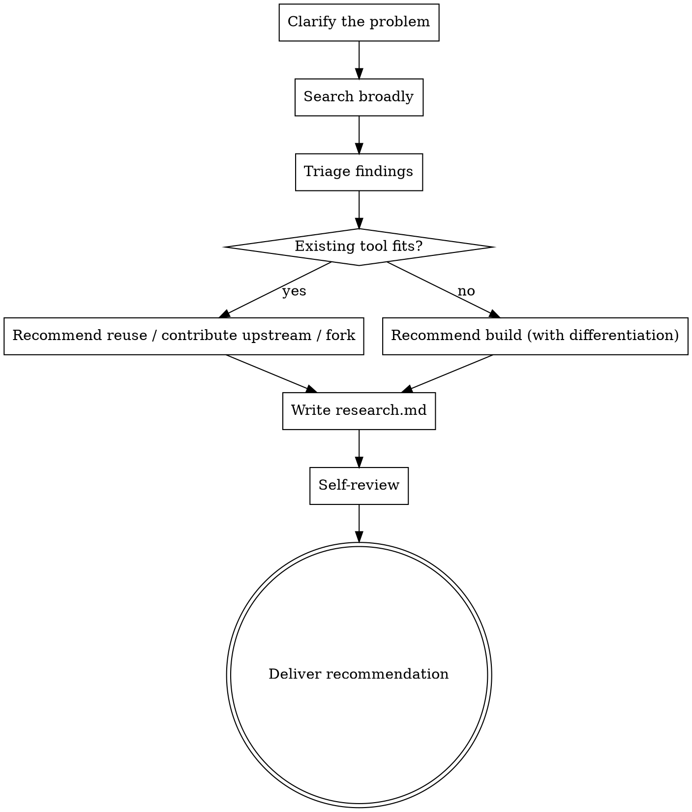

# Prior Art Research

Survey what already exists for a given problem and produce a structured research document with an honest build-vs-reuse recommendation.

The most important job of this skill is to **genuinely consider not building**. Claude's default tendency is to go along with what the user wants. This skill exists to counteract that. If something good already exists, say so clearly.

## Anti-Pattern: "But The User Asked For It"

The user asked you to research, not to validate a foregone conclusion. Treat "I want to build X" as a hypothesis to test, not a directive to rationalise. A skilled researcher who finds an existing solution that fits says so — they don't bury the finding.

## Anti-Pattern: "It's Different Because..."

Watch for thin justifications: "but ours would be in TypeScript", "but ours would be self-hosted", "but ours wouldn't have feature Z we don't need anyway". These are rationalisations, not differentiation. Real differentiation is: a capability the existing tool fundamentally cannot provide, a use case it explicitly does not target, or a constraint (license, data residency, integration) that makes it unusable here.

## Checklist

You MUST create a task for each of these items and complete them in order:

1. **Clarify the problem** — ask 1-3 targeted questions to understand the problem, not the solution
2. **Search broadly** — web search for existing implementations, libraries, services, academic work, competing products
3. **Triage findings** — for each candidate, assess fit against the actual problem
4. **Make the recommendation** — build, reuse, contribute upstream, or fork; with reasoning
5. **Write `research.md`** — to `docs/research/YYYY-MM-DD-<topic>-research.md`
6. **Self-review** — confidence markers, no smuggled assumptions, honest comparison
7. **Deliver** — present the recommendation directly; the user decides what to do next

## Process Flow



## The Process

### 1. Clarify the problem

Ask 1-3 questions, one at a time, to pin down **the problem**, not the solution. Examples:

- "What problem are you trying to solve, in one sentence — without naming a solution?"
- "Who is the user and what do they do today instead?"
- "What would have to be true about an existing tool for you to use it instead of building?"

That last question is critical. The answer becomes your evaluation rubric.

### 2. Search broadly

Use web search. Cast a wide net — at least 5-10 candidates across categories:

- **Direct competitors** — tools that do the same thing
- **Adjacent tools** — tools that solve a superset or subset of the problem
- **Libraries / frameworks** — building blocks the user could compose instead of building from scratch
- **Academic / research prior art** — papers, theses, formal models
- **Failed or abandoned attempts** — equally informative; understand *why* they failed

Search terms should target the problem, not the proposed solution. If the user said "I want to build a workflow engine for X", search for both "workflow engine X" and the underlying problem ("how do people coordinate X today").

### 3. Triage findings

For each candidate, capture:

- **Name + link**
- **What it does** (one sentence)
- **License / cost / hosting model**
- **Last meaningful activity** (commit, release — abandoned projects matter)
- **Fit assessment** against the rubric from step 1

Then bucket them:

- **Strong fit** — would solve the user's problem with reasonable effort
- **Partial fit** — solves part, or solves it with significant adaptation
- **Poor fit** — same space, but doesn't actually address the problem
- **Inspiration only** — informs design but isn't reusable

### 4. Make the recommendation

Pick one of:

- **Reuse** — use tool X as-is. Justify why it fits.
- **Contribute upstream** — tool X is close; the gap is small enough that contributing is better than forking.
- **Fork / wrap** — tool X is the right base but needs substantial adaptation that isn't upstreamable.
- **Build** — no existing tool is close enough. Articulate the specific differentiation in one or two sentences. "Different language" or "different stack" are not differentiation.

Lead with the recommendation. Do not bury it under options.

### 5. Write `research.md`

Save to `docs/research/YYYY-MM-DD-<topic>-research.md`. Structure:

```markdown
# Prior Art Research: <topic>

**Date:** YYYY-MM-DD
**Recommendation:** <build | reuse <tool> | contribute upstream to <tool> | fork <tool>>

## Problem statement
<one paragraph — the problem, not the solution>

## Evaluation rubric
<what would have to be true for an existing tool to suffice>

## Surveyed options

### <Tool 1> — <strong fit | partial | poor | inspiration>
- **Link:** <url>
- **What it does:** <one sentence>
- **License / cost:** <...>
- **Last activity:** <...>
- **Fit:** <assessment against rubric>

<repeat for each candidate>

## Comparison
<table or prose comparing the strong/partial fits against the rubric>

## Recommendation
<build | reuse | contribute upstream | fork>, because <reasoning>.

<If "build": specific differentiation — what existing tools fundamentally cannot do>
<If "reuse": how to adopt, what to watch for>
<If "upstream": what the contribution looks like, rough effort estimate>
```

### 6. Self-review

Read the doc with fresh eyes:

1. **Confidence markers** — every non-trivial claim is tagged `[confirmed]`, `[likely]`, or `[uncertain]`. If you can't determine something, say so explicitly. Do not speculate.
2. **Buried lede** — is the recommendation visible in the first 10 lines? If not, fix it.
3. **Smuggled assumptions** — is "build" justified by genuine differentiation, or by stack preferences and vibes?
4. **Survivorship bias** — did you only find tools the user already knows about, or did you actually search?
5. **Abandoned projects** — if similar projects were abandoned, did you investigate why? That's often the most valuable finding.

Fix issues inline.

### 7. Deliver

Present the recommendation directly:

> "Research written to `<path>`. Recommendation: **<build | reuse <tool> | …>**. <One-sentence reasoning.>"

The user takes it from there. Do not push them toward the next step — they may want to think, share the doc, or do something entirely different. If they ask what to do next, suggest options based on the recommendation; don't presume.

## Epistemic Rules

- **Distinguish observation from inference.** "Tool X has 200 GitHub stars" is observation. "Tool X is unmaintained" is inference — back it with last-commit date or maintainer statement.
- **Confidence tags are mandatory.** `[confirmed]` = directly verified from source. `[likely]` = strong indirect evidence. `[uncertain]` = informed guess, treat with skepticism.
- **Negative results are results.** "I searched for X and found nothing relevant" is a valid finding. Record what you searched for.
- **Don't paper over gaps.** If the user's problem statement is too vague to evaluate fit, say so and re-clarify rather than pretending to evaluate.

## Key Principles

- **Default to not building.** Building is the most expensive option; the bar should be high.
- **One question at a time** during clarification.
- **Lead with the recommendation** in the document and in conversation.
- **Real differentiation only.** Stack, language, and aesthetic preferences are not differentiation.
- **Honesty over agreeableness.** A research doc that recommends building everything the user proposes is a broken research doc.
