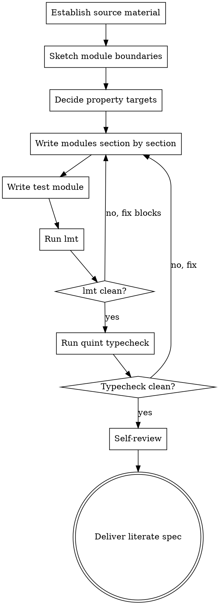

# Quint Literate Spec

Write a literate Quint specification: prose and formal Quint code interleaved in a single markdown file, with code blocks tagged so `lmt` can extract them to `.qnt` files, then validated by `quint typecheck`.

This skill is specifically about **the literate-spec authoring loop**: structuring the markdown, tagging blocks correctly, and validating the result. Deeper Quint work — language constraints, model checking, witnesses, test debugging, refactoring — is out of scope here. If the user already has `.qnt` files and wants to edit, verify, or debug them, this is the wrong skill.

<HARD-GATE>
Do NOT declare the spec done until BOTH of these have run cleanly:
1. `lmt <spec.md>` extracts all tagged blocks without error
2. `quint typecheck <extracted.qnt>` passes for every extracted file

If either fails, fix the spec and re-run. A literate spec that does not extract or typecheck is not a deliverable.
</HARD-GATE>

## Anti-Pattern: Restating Code In Prose

Prose around a code block should explain **intent and rationale**, not describe what the code says. The reader can read the code. They cannot read your mind.

| Bad | Good |
|---|---|
| "We define a state variable `inbox` of type `List[Message]`." | "Messages are buffered in arrival order so we can model out-of-order delivery without reordering the model state itself." |
| "The `send` action appends to the inbox." | "`send` is non-blocking by design — the model never refuses a send, even at capacity, so we can later check what the system does under overload." |

If removing the prose wouldn't lose information, remove it.

## Anti-Pattern: Spec As Implementation

A Quint spec models the *protocol or system*, not the code that will implement it. Avoid:

- Optimisation details (caching, batching) unless the optimisation has observable behaviour
- Error-handling minutiae below the protocol level
- Concrete data structures where an abstract set or map suffices

The spec should be at the level where invariants can be stated and checked. If you find yourself modelling memory layout, you've gone too low.

## Checklist

You MUST create a task for each of these items and complete them in order:

1. **Establish the source material** — design doc, requirements, prose description, the user's verbal model — whatever is being formalised
2. **Sketch module boundaries** — one module per logical component, plus a top-level composition module if needed
3. **Decide on the property targets** — what invariants and temporal properties this spec will check, and what is assumed about the environment (not checked)
4. **Write modules section by section** — for each: state vars → actions → invariants, with prose explaining intent
5. **Write a test module** — `<spec>Tests.qnt` with at least one `run` exercising the happy path
6. **Extract with `lmt`** — verify all blocks extract cleanly
7. **Typecheck with `quint typecheck`** — fix until clean
8. **Self-review** — invariants justified, properties vs assumptions distinguished, prose explains why not what
9. **Deliver** — present the literate spec; further verification work is the user's call

## Process Flow



## The Process

### 1. Establish the source material

Ask the user what's being formalised. Useful inputs include:

- A design or architecture document
- A requirements document
- A protocol description (paper, RFC, blog post)
- The user's own description in chat

If the source is ambiguous or sparse, ask a few clarifying questions before sketching modules — formalising a fuzzy mental model produces a fuzzy spec.

### 2. Sketch module boundaries

Map logical components from the source to Quint modules. Typical pattern:

- One module per major component (e.g. `Storage`, `Coordinator`, `Client`)
- One top-level module composing them (e.g. `System`)
- One test module per logical unit, in a separate file (e.g. `SystemTests.qnt`)

Write the module list as prose first — names, one-sentence purpose each, and which file each lives in. Get user agreement on the breakdown before formalising. Restructuring later is expensive.

### 3. Decide property targets

For each module, list:

- **Invariants** — properties that must hold in every reachable state (safety)
- **Temporal properties** — properties about behaviour over time, if any (liveness, fairness)
- **Assumed environment** — what the model assumes the outside world does (these are NOT checked, they are constraints on the model)

Write this list in prose before any code. The point of a formal spec is to check properties; if you don't know which properties, the spec has no target.

### 4. Write modules section by section

For each module, in this order:

1. **Prose introduction** — what this module models and why
2. **Type declarations** — sum types, type aliases
3. **State variables** — what the module remembers across actions
4. **Initial state** (`init` action) — starting condition
5. **Actions** — state transitions; one prose paragraph per non-trivial action explaining intent
6. **Invariants** — each with prose explaining why it matters and what its violation would mean
7. **Temporal properties** (if any) — same treatment

#### Literate format — `lmt`

Quint code blocks must be tagged with the target file and `+=`:

````
```quint mySpec.qnt +=
module MySpec {
  var counter: int

  action init = counter' = 0
  action inc = counter' = counter + 1

  val nonNegative = counter >= 0
}
```
````

Rules:

- Every Quint code block targets a specific `.qnt` file via the tag (e.g. `mySpec.qnt +=`)
- Multiple blocks targeting the same file are concatenated in order
- Test modules go in a separate file (e.g. `mySpecTests.qnt +=`)
- Untagged ` ```quint ` blocks are NOT extracted — use them only for illustrative snippets that should stay markdown-only (rare; prefer always tagging)
- The first block for a file usually contains the `module` declaration; subsequent blocks add to it

Reference: <https://quint.sh/docs/literate>

#### Prose discipline

For each spec block, the surrounding prose must answer at least one of:

- **Why** is this here? (motivating constraint, requirement traced from)
- **What invariant** does this protect or rely on?
- **What was the alternative** and why this instead?

If the prose only restates the code, delete it.

#### Quint language constraints

Quint has hard language limitations that bite during type-checking. The most common gotchas:

- **No string manipulation** — strings are opaque; use sum types or structured data instead
- **No nested pattern matching** — match one level at a time with sequential `match`
- **No destructuring** — use explicit field access (`.field`, `._1`, `._2`)
- **`init` and step actions are special** — they assign to primed vars (`var'`) for every state variable

If you encounter language errors during typecheck and aren't sure why, the official Quint docs at <https://quint.sh> have the authoritative reference.

### 5. Write a test module

Add at least one `run` definition exercising a happy-path scenario. This validates that the actions compose into reachable behaviour, not just that types check. Tag the block to a separate `<spec>Tests.qnt` file:

````
```quint mySpecTests.qnt +=
module MySpecTests {
  import MySpec.*

  run happyPath = init.then(inc).then(inc).expect(counter == 2)
}
```
````

If the source material describes failure modes or edge cases, add `run`s for them too. Failures the spec cannot reproduce are failures the spec cannot reason about.

### 6. Extract with `lmt`

```bash
lmt docs/specs/YYYY-MM-DD-<topic>-spec.md
```

This produces the `.qnt` files (location depends on `lmt` configuration). Verify all expected files are produced and contain the expected blocks. If `lmt` errors, the most common causes are:

- A block tagged with a filename but missing `+=`
- Mismatched fence backticks
- A code block whose content is not valid for concatenation (e.g. a stray top-level `}`)

Fix the markdown and re-run.

### 7. Typecheck

For each extracted file:

```bash
quint typecheck <file>.qnt
```

Resolve every error before continuing. Common issues map to the constraints listed in step 4.

### 8. Self-review

Read the literate spec end-to-end with fresh eyes:

1. **Property coverage** — every invariant listed in step 3 is actually defined in the spec, with a name. Every temporal property too.
2. **Assumed vs. checked** — environmental assumptions are documented as prose or comments, not stated as invariants. Invariants are things the system *guarantees*, not things the environment *provides*.
3. **Prose explains why** — no code-restating prose. Each block has a reason to be there.
4. **Module boundaries match source** — the module breakdown still reflects what's being modelled; if it drifted, decide whether to update the spec or flag the source material.
5. **Tests exercise non-trivial paths** — happy-path-only tests are weak; if the source has interesting state transitions, tests should reach them.
6. **`lmt` and `quint typecheck` both clean** — re-run if anything changed during review.

Fix inline.

### 9. Deliver

Present:

> "Literate spec written to `<path>`. `lmt` extracts to `<files>`, `quint typecheck` passes. Properties checked: `<list>`."

The user takes it from there — they may want to run invariant checks, explore witnesses, refine the model, or hand it to someone else. Do not presume the next step.

## Output File

`docs/specs/YYYY-MM-DD-<topic>-spec.md` — the literate markdown.
Extracted `.qnt` files land wherever `lmt` is configured (typically alongside, or in a `spec/` directory).

## Key Principles

- **Validate before declaring done.** `lmt` clean and `quint typecheck` clean are non-negotiable.
- **Prose explains intent.** If it restates code, delete it.
- **Invariants are guarantees, not assumptions.** Document the difference.
- **Stay at the protocol level.** Don't model implementation details.
- **Scope is the authoring loop.** Verification, model checking, and ongoing edits to `.qnt` files are out of scope here.
